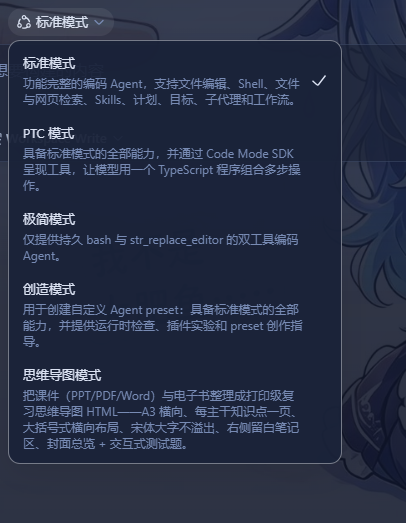
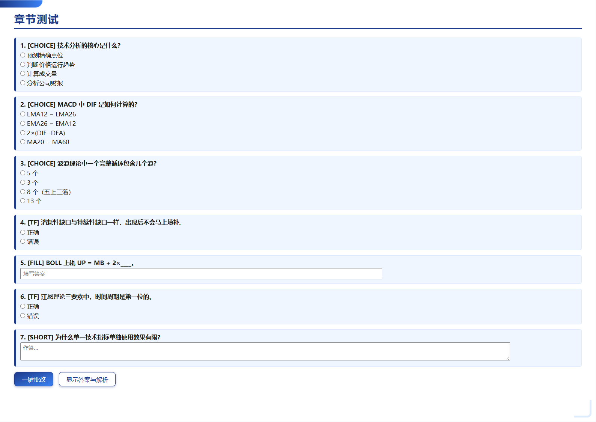
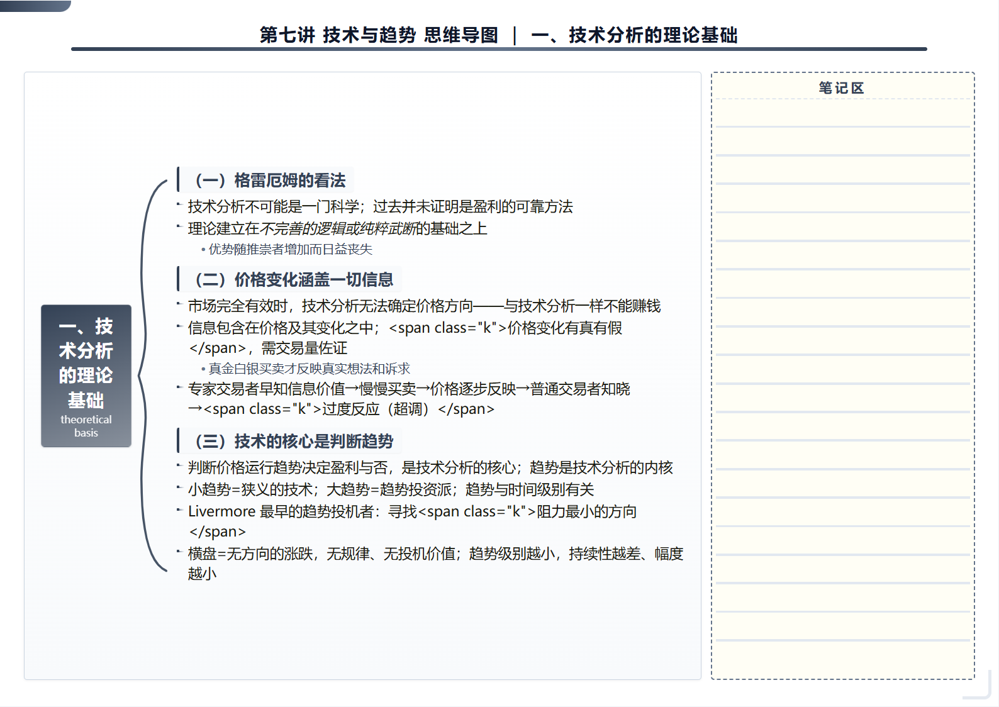

# dsh-mindmap (mind-map mode)

English | [中文](README.zh.md)

A DSH plugin and agent preset that turn course slides (PPT/PDF/Word) and ebooks into **print-ready review mind-map HTML**.

## Output previews (generated in one step)

| Mode selector (beside creative mode) | Cover overview |
|---|---|
|  |  |

| Cover overview | Interactive quiz (one-click grading) |
|---|---|
|  |  |

### Four mind-map styles (choose mind-map mode for a new session, then select its default style below)

| Classic braces | Minimal business |
|---|---|
|  |  |

| Creative | Academic organization |
|---|---|
|  |  |

> These are actual rendered outputs captured with Playwright. The mode and style selectors come from the running DSH Web GUI. `mm_generate` produced the mind-map pages from the “Securities Investment and Technical Analysis · Lecture 7: Techniques and Trends” slides, in A3 landscape with **sans-serif fonts**, one branch per page and a blank notes area on the right. Printing preserves page breaks.

- **Frontend**: choose **mind-map mode** for a new session, then select a default style below it: classic braces, minimal business, creative or academic organization. The new-session preset selector lists mind-map mode alongside standard and creative modes.
- **Preview**: the plugin does not embed a previewer. Open its generated HTML with **dsh-IDE**, preferably installed alongside this plugin as described below.
- **Agent capabilities**: `mm_generate` generates HTML with per-page overflow reports and style parameters; `mm_extract` extracts plain-text slide material. The `mindmap-builder` skill defines the complete horizontal brace-based mind-map construction method.
- **Output specification** (matching `组胚思维导图_02_人体发育总论.html`):
  - A3 landscape (420mm×297mm), with print page breaks; each page covers one main knowledge branch.
  - Horizontal braces: root on the left in a gradient/highlight box, SVG braces and stacked groups on the right.
  - **Sans-serif fonts** (Microsoft YaHei / 微软雅黑 / 思源黑体) for a clearer, more modern appearance than serif text.
  - **Visual design**: four styles, each with multiple palettes rotating by page; gradient roots, primary-color group-heading capsules, dot connectors, gradient header dividers and corner decoration; rounded nodes, restrained colors, balanced layouts and breathing room.
  - **Large type filling the page**: items start at 17pt, with dense pages reduced to 12.5–15pt to avoid overflow; titles/roots use 21pt, groups 19pt and subitems 15pt. Vertical `space-evenly` distribution fills 60–96% of the page without large empty regions.
  - Overflow prevention: estimate character capacity before rendering, reduce type size for excess content, and report branches needing separate pages if still too large.
  - A blank dashed notes area on the right lets students add their own notes.
  - Cover page with large title, sources and contents index; optional interactive quiz pages with choice/tf/fill/short questions and one-click grading, using compact layouts for many questions.

## Installation

```powershell
# 1. 构建插件（在插件目录）
cd ~/.dsh/plugins/dsh-mindmap
pnpm install --no-frozen-lockfile
pnpm exec tsc -p tsconfig.build.json
pnpm exec tsdown

# 2. 安装到 web profile（依赖 + bundle 均已加入 package.json）
cd ~/.dsh/profiles/web
pnpm install --no-frozen-lockfile

# 3. 清理 pnpm 引入的 harness 嵌套副本（每次 install 后必做）
cd ~/.dsh/profiles/web/node_modules/@deepseek-ai
Remove-Item cordis,cosmokit,dsh-credentials,dsh-home-paths,dsh-tools,schemastery -Recurse -Force -ErrorAction SilentlyContinue

# 4. 重启 dsh web（加载新 bundle 与预设）
```

> **Install dsh-IDE alongside this plugin** to preview the generated mind-map HTML. Install `dsh-IDE` in DSH Settings → Plugins, then open generated `.html` files in the IDE. This plugin focuses on course-material-to-print-ready-HTML generation and does not embed a previewer.

## Usage

### Method one: ask the agent to generate (recommended)

Choose **mind-map mode** for a new session, then ask:

> Organize the PPT files and ebooks under `D:\课件\` into mind maps using the mindmap-builder skill, one main branch per page. Write `D:\复习\思维导图_01.html` and include a quiz.

The agent parses materials through MinerU, extracts shared slide/ebook priorities, organizes MindmapDoc JSON, invokes `mm_generate`, and splits or compresses branches according to overflow reports until every page fits.

### Preview the result (dsh-IDE)

After generation, ask the agent to open the output HTML with **dsh-IDE** for preview or printing:

- Ask in the session: `Open D:\复习\思维导图_01.html with dsh-IDE`
- Or open the file directly in dsh-IDE.

### MindmapDoc JSON structure

```json
{
  "title": "人体发育总论",
  "course": "组织胚胎学自学课件",
  "ebook": "组织学与胚胎学（第10版）",
  "branches": [
    {
      "id": "一",
      "title": "概述与胚胎分期",
      "en": "overview",
      "groups": [
        {
          "heading": "（一）人体发生",
          "items": [
            { "text": "从受精卵到胎儿出生，历时约 <span class=\"k\">266 天（38 周）</span>" },
            { "text": "<b>胚（前 8 周）</b>：关键时期，易受环境因素影响致畸",
              "subs": ["细节子条目"] }
          ]
        }
      ]
    }
  ],
  "quiz": [
    { "type": "choice", "question": "…", "options": ["A","B","C","D"], "answer": 1,
      "explanation": "…", "pitfall": "…" }
  ]
}
```

## Directory structure

```
dsh-mindmap/
├── cordis.patch.yml         # bundle patch：注入 mindmap 插件行
├── package.json             # @deepseek-ai/dsh-mindmap（host + client 双面）
├── src/
│   ├── index.ts             # host 入口：路由 + 工具 + prompt 通告
│   ├── host/
│   │   ├── generator.ts     # HTML 生成器（范例样式 + 防溢出预算）
│   │   ├── routes.ts        # /api/dsh-mindmap/{generate,preview,list}
│   │   └── tools.ts         # mm_generate / mm_extract
│   └── client/              # 侧边栏入口 + 思维导图面板
│       ├── index.ts
│       ├── sidebar-entry.ts
│       ├── mount.tsx
│       ├── api.ts
│       ├── locales.ts
│       └── panel/           # MindmapPanel.tsx + controller + css
├── skills/mindmap-builder/  # 思维导图构建方法 skill（方法论固化）
└── tests/smoke.mjs          # 渲染器冒烟测试
```

The mind-map agent preset lives at `~/.dsh/.agent-presets/mindmap/`, containing `agent.cordis.yml`, `preset.yml` and a skill copy. The dsh-agent-presets roster discovers it automatically without additional registration.

## Limitations

- PPT/PDF/DOCX parsing depends on local MinerU (`mineru_parse_document`); the plugin itself reads only plain-text sources.
- Generated HTML is self-contained with no external-resource dependencies. Browser Ctrl+P prints A3 landscape PDF.
- Overflow reports estimate Chinese-character counts and line heights. Actual printing is authoritative in unusual font environments; split branches as required by the report.
